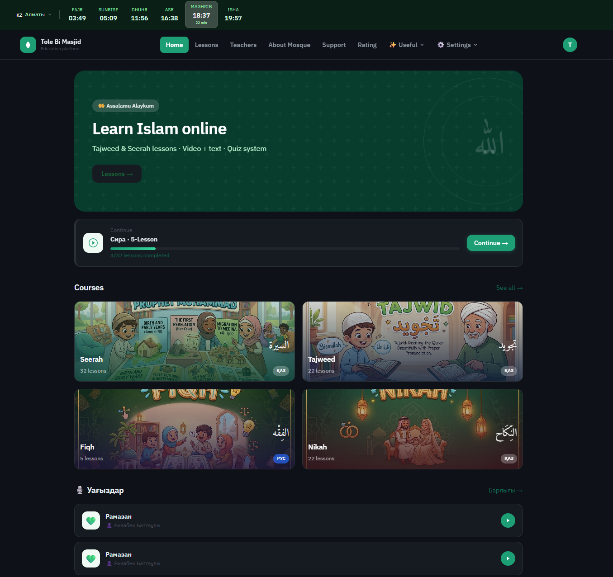
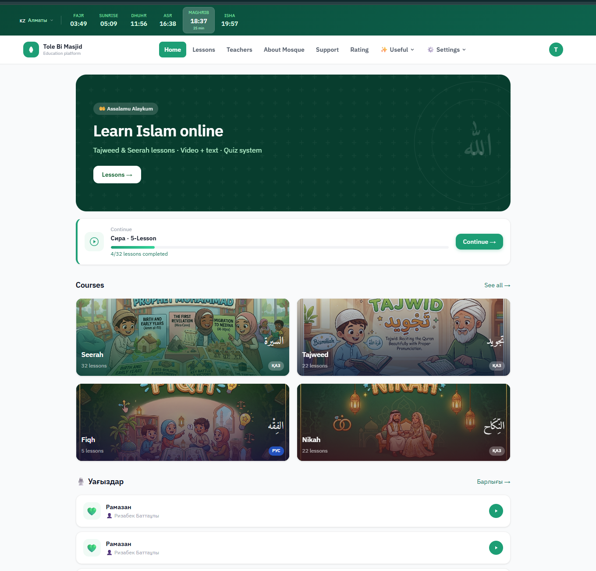
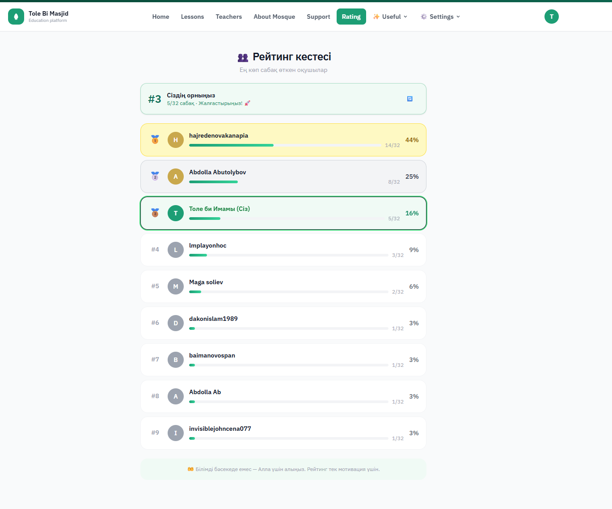
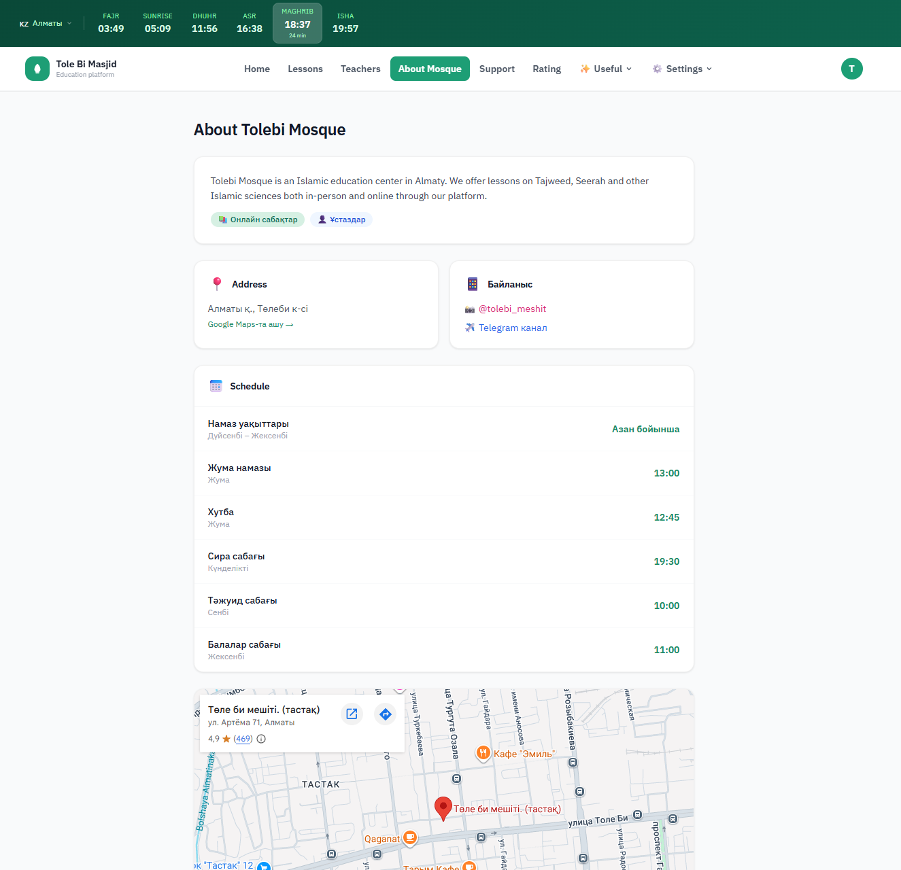
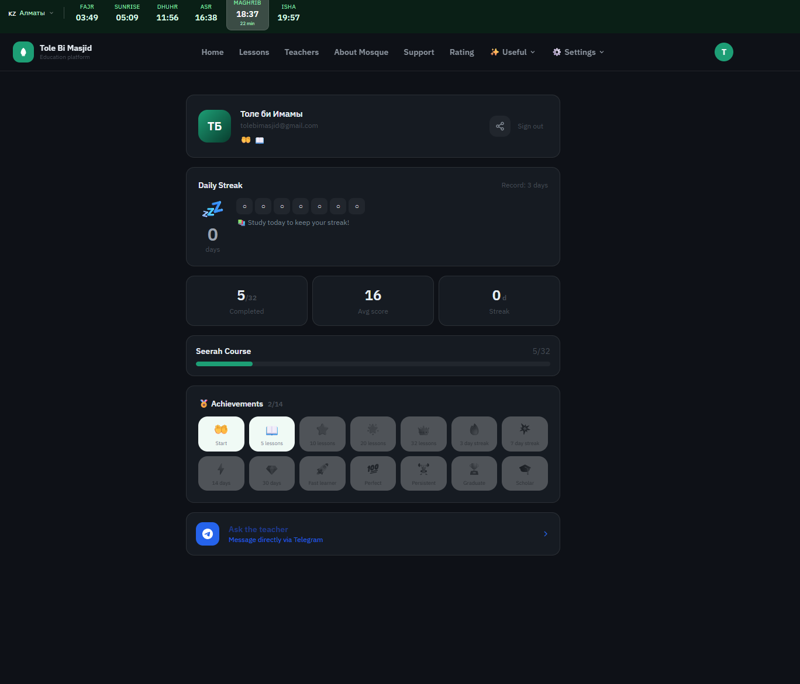

# 🕌 Tole Bi Masjid — Islamic Education Platform

A web platform built for Tole Bi Mosque in Almaty, Kazakhstan.  
Real users, live in production.

**Live:** [devcodes.kz](https://devcodes.kz)

---

## What it does

An online learning platform for Islamic education — lessons, quizzes, prayer times, and more.  
Built and maintained by me as a personal/freelance project.

---

## Screenshots

---

## Features

### 📚 Learning System (LMS)
- Courses: Seerah, Tajweed, Fiqh, Nikah
- Lesson progress tracking per user
- Video + text lessons
- Quiz system
- Course filtering by language (KAZ / RUS / ENG)

### 🕐 Prayer Time Tracker
- Real-time prayer times based on user location
- Countdown to next prayer (shown in header)
- Supports multiple cities in Kazakhstan

### 🏆 Leaderboard
- Ranks users by lessons completed
- Shows % completion progress
- Motivational — not competitive

### 📖 Useful Tools
- **Dua collection** — Arabic text, transliteration, translation
- **Islamic Calendar**
- **Arabic Dictionary**
- **News**

### ⚙️ Other
- Dark / Light theme
- Multilingual UI: Kazakh, Russian, English
- PWA (installable on mobile)
- Teacher profiles
- Mosque info page with Google Maps embed

---

## Tech Stack

| Layer | Tools |
|-------|-------|
| Frontend | React, Vite |
| Backend | Supabase (auth, database, storage) |
| i18n | react-i18next |
| PWA | Vite PWA plugin |
| Routing | React Router |

---

## Notes
- Built for a real mosque with real active users
- Multilingual from the start — KAZ / RUS / ENG
- Ongoing project — features added based on community feedback

---

*Personal project. All code written by me.*
